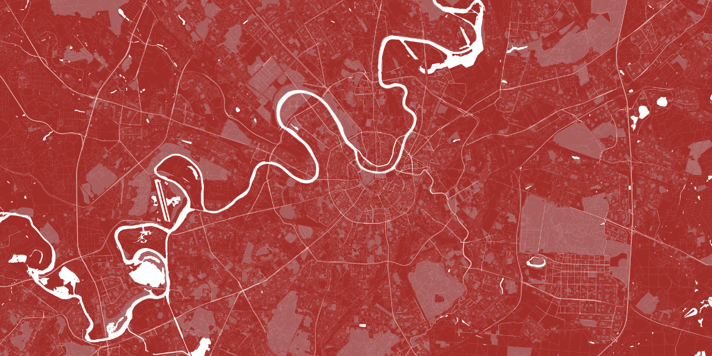

# Map Poster Creator

Create minimalist road-map posters from OpenStreetMap data. Map Poster Creator
combines a Polygon/MultiPolygon boundary with a Geofabrik shapefile extract,
then renders roads, water, and green-area layers as a PNG. It provides a CLI,
a Python API, and a FastAPI HTTP service.

This repository is a fork of
[k4m454k/MapPosterCreator](https://github.com/k4m454k/MapPosterCreator). It is
distributed under the [MIT License](LICENSE).



## Requirements

Use Python 3.10 or newer. Although older package metadata declared Python 3.7,
the current source uses Python 3.10 union-type syntax.

The GeoPandas stack may require native geospatial libraries:

- Debian/Ubuntu: `sudo apt-get install libgeos-dev`
- macOS: `brew install geos`
- Windows: install compatible GDAL/Fiona wheels if pip cannot install their
  native dependencies.

## Install

From a checkout:

```bash
python -m venv .venv
source .venv/bin/activate
pip install --upgrade pip
pip install -e .
```

Verify the command-line interface:

```bash
mapoc --version
mapoc --help
```

## Create a poster

With full generated data available, the CLI can resolve a city, obtain its
administrative boundary from geoBoundaries, and download the appropriate
Geofabrik extract:

```bash
mapoc poster "Moscow, Russia" \
  --colors white black \
  --width 20cm \
  --dpi 300
```

Ambiguous city names select the highest-population match by default. Use
`--interactive` to choose a match or `--country-code` to narrow the lookup.

To use already downloaded inputs, supply both paths. A city is not required
when the boundary and shapefile directory are explicit:

```bash
mapoc poster \
  --shp-path /data/germany-latest-free \
  --geojson-path /data/berlin-boundary.geojson \
  --colors coral \
  --output-prefix berlin
```

Coordinates can also be read from a JSON array, CSV, or whitespace-separated
file. Pairs must use longitude, latitude order:

```bash
mapoc poster \
  --coordinates-file boundary.json \
  --shp-path /data/germany-latest-free \
  --colors white \
  --output-prefix berlin
```

The shapefile directory must directly contain:

- `gis_osm_roads_free_1.shp`
- `gis_osm_water_a_free_1.shp`
- `gis_osm_pois_a_free_1.shp`

The GeoJSON file must contain at least one `Feature` with `Polygon` or
`MultiPolygon` geometry. Only the first feature is used; interior rings are
ignored. Generated posters are written to `~/mapoc` by default.

## Colour schemes

The built-in schemes are `black`, `white`, `red`, and `coral`.

```bash
mapoc color list
mapoc color show coral
mapoc color add coffee \
  --facecolor "#433633" \
  --water "#5c5552" \
  --greens "#8f857d" \
  --roads "#decbb7"
```

`browse` commands open the source sites in a browser:

```bash
mapoc browse shp
mapoc browse geojson
```

## Data setup

Generated indexes are not bundled with the source. Run the setup orchestrator
after installing the package:

```bash
bash scripts/setup.sh
```

Full setup creates GeoNames headers, country/city indexes, a Geofabrik region
tree and URL map, geoBoundaries data, and optionally the extended colour
library. It performs large network downloads.

For coordinate-based operation without city lookup or geoBoundaries:

```bash
bash scripts/setup.sh --tiny --non-interactive
```

Use `--output DIR` to select another data directory. `--skip-colors` omits
`docc_colors.json`, but the current colour loader opens that file
unconditionally, so colour listing and poster rendering require it.

See [Data sources](docs/data-sources.rst) and
[configuration](docs/configuration.rst) for generated files and environment
variables.

## HTTP service

Start the FastAPI service from an installed checkout:

```bash
uvicorn map_poster_creator.api:app --host 0.0.0.0 --port 8000
```

The API is available at `http://localhost:8000`, with Swagger UI at `/docs`
and ReDoc at `/redoc`.

| Endpoint | Purpose |
| --- | --- |
| `GET /` | Service metadata |
| `GET /health` | Liveness and data readiness |
| `GET /colors` | Available colour schemes |
| `POST /poster` | Render from `{lon, lat}` coordinate objects |
| `POST /poster/simple` | Render from `[[lon, lat], ...]` |

When `shp_path` is omitted, region selection tries explicit
`latitude`/`longitude`, then `city`/`country`, then the polygon centroid.
See the [HTTP service guide](docs/service.rst) for request examples, logging,
errors, and readiness semantics.

## Containerization

The image is intended to run the HTTP service on port 8000 and uses:

- `MAPOC_DATA_DIR=/app/data`
- `MAPOC_OUTPUT_DIR=/app/output`
- `LOG_DIR=/app/logs`
- `LOG_LEVEL=INFO`

The Dockerfile supports `NO_TINY` and `DATA_DIR` build arguments, stages
generated data, and includes a `/health`-based health check.

Two current implementation issues prevent presenting the image as
build-and-run ready:

1. `Dockerfile` references a root `requirements.txt` that is not present;
   dependencies are currently declared in `pyproject.toml`.
2. Automatic image setup passes `--skip-colors`, while poster rendering
   currently requires `docc_colors.json`.

There is no committed Docker Compose or CI/CD workflow. The GHCR name in the
Dockerfile is a tagging convention only. See the
[containerization guide](docs/containerization.rst) for the complete build and
runtime data flow.

## Development and tests

Install development dependencies and run the configured checks:

```bash
pip install -e ".[dev]"
pre-commit run --all-files
pytest
```

`pytest.ini` enables branch coverage and enforces a 70% threshold. Curl-based
tests under `tests/` exercise a running HTTP service.

## Documentation

The complete Sphinx documentation covers configuration, data sources,
containerization, the HTTP service, troubleshooting, architecture, and the
programmatic API.

```bash
pip install -r docs/requirements.txt
make -C docs html
```

Open `docs/_build/html/index.html` after a successful build.
